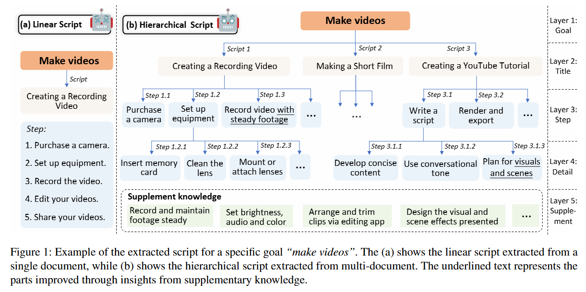
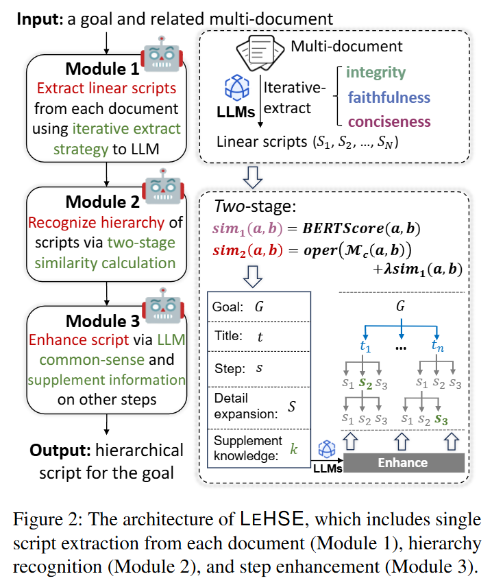
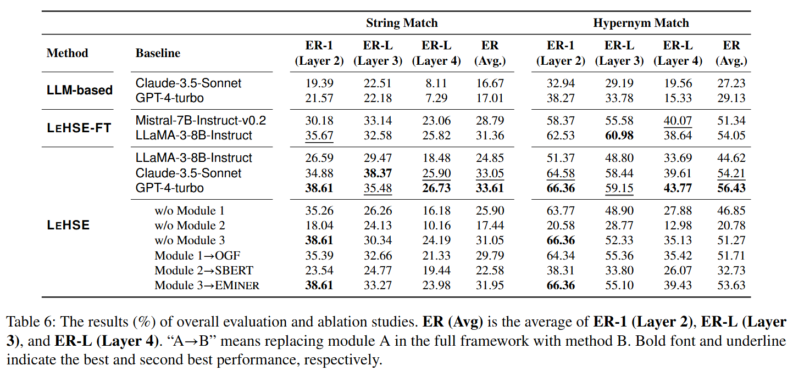

    <h1>   LEHSE: Large Language Model Enhanced Hierarchical Script Extraction from Multiple Documents</h1>

The repo is for the implementation and evaluation of LEHSE, a powerful framework for multi-document script extraction. Source codes for **LEHSE: Large Language Model Enhanced Hierarchical Script Extraction from Multiple Documents**.

## 🌟Contributions

- To the best of our knowledge, we are among the first to explore MDSE by identifying its key challenges and proposing a non-trivial solution;
- We pioneer the integration of LLMs and propose a novel framework, LEHSE, based on an extract-assemble notion. Additionally, we offer a computationally efficient alternative, LEHSE-FT;
- We further developed a new benchmark dataset, MDScript, which provides multiple document sources and a manually annotated hierarchical script for each goal;
- Extensive experiments demonstrate the superiority of MDScript through both automatic and human evaluation, and moreover, smaller specialized models fine-tuned with MDScript data achieve capabilities comparable to LLMs.

## 📖 Introduction

### Multi-Document Script Extraction (MDSE)

    
     

### Large Language Model enhanced hierarchical script extractor (LEHSE)

    
     

#### Results

  <figure>
    
  </figure>

